# WealthPilot

基于 Multi-Agent 架构的个人投资辅助决策系统

**当前版本：v3.6**

## 项目简介

个人投资者在真实投资过程中，普遍面临一个核心问题：**信息、认知与执行是割裂的。** 持仓分散在多个平台看不清全貌，投研信息很多却难以直接作用于具体持仓，明知投资纪律却在关键时刻难以执行。

WealthPilot 围绕这一问题，构建了一个完整的投资决策闭环：以统一持仓视图作为决策上下文，通过 AI 对话将用户问题转化为结构化的决策过程，并以规则引擎持续约束投资行为。与一般投资问答工具不同，它不是脱离用户资产状态给出泛泛建议，而是把投资问题转化为一个有上下文、有约束、有完整推理链路的辅助决策过程。

## 设计理念

WealthPilot 不是一个"直接给结论"的投资问答工具，而是强调三个核心原则：

- **基于真实持仓**：所有决策建立在用户当前资产状态之上，而不是脱离持仓的泛泛建议
- **过程可解释**：完整展示从意图识别到最终结论的决策链路，而不是黑盒输出
- **受纪律约束**：通过规则引擎在决策链路中前置校验投资纪律

本质上，它是一个 **LLM 负责推理、持仓状态提供上下文、投资规则提供约束** 的决策系统。

## 核心功能

以投资决策为核心，围绕"看清持仓、做出决策、执行纪律"构建完整闭环：

| 模块        | 解决的问题                                               | 状态     |
| --------- | --------------------------------------------------- | ------ |
| 投资决策      | 针对具体持仓给出有依据的买卖建议，而不是泛泛的市场观点；支持多轮追问、宏观问题分析、多标横向对比    | ✅ v3.0 |
| 投资账户总览    | 持仓分散在多个券商看不清全貌；支持老虎 / 富途 / 雪盈持仓自动同步，统一展示资产分布与盈亏     | ✅ v3.0 |
| 投研观点      | 投研信息很多，但难以和具体持仓挂钩；在决策时直接调取对应标的的研究观点，支持美股 / 港股 / A 股 | ✅ v2.5 |
| 资产配置      | 不知道自己的资产结构是否合理；基于五大资产类别给出配置方案，并校验是否符合自己的投资纪律        | ✅ v2.3 |
| 投资纪律      | 明知纪律却在关键时刻难以执行；将个人投资规则写入系统，每次决策时自动前置校验              | ✅ v2.0 |
| 用户画像与投资目标 | 系统需要理解你的风险偏好和目标，才能给出匹配的建议；支持问卷填写和截图解析两种方式           | ✅ v2.1 |
| 私有知识库      | 投研观点、投资纪律、配置原则等知识以 Markdown 存储，通过 RAG 语义检索参与每次决策         | ✅ v3.6 |

## 技术栈

### 前端

- **React 19** + **Vite 8** + **TypeScript**
- **Tailwind CSS v4**
- **React Router v7**（客户端路由）
- **Zustand v5**（状态管理）
- **Recharts**（资产分布图表）
- **ReactMarkdown** + remark-gfm（AI 对话渲染）
- **Lucide React**（图标）

### 后端

- **Python 3.11**
- **FastAPI** + **uvicorn**（RESTful API + SSE 流式接口）
- **SQLAlchemy 2.0**（ORM，SQLite）
- **OpenAI ≥ 1.20**（LLM 调用）
- **AKShare**（港股 / A 股行情数据）
- **Alpha Vantage API**（美股基本面 / 新闻 / 财报数据）
- **Tiger OpenAPI SDK / Futu OpenD / 雪盈 API**（券商持仓同步）

## 架构说明

### 系统架构图



### 1. 概述

v3.0 的核心是将投资决策模块从单体 pipeline 重构为 **PEER Multi-Agent + Skills 协议**架构。PEER 是项目参考蚂蚁开源框架 [agentUniverse](https://github.com/alipay/agentUniverse) 的设计思想实现的四层 Agent 架构，代表 Planning / Executing / Expressing / Reviewing，四个 Agent 各司其职，通过标准化的数据契约串联（设计上参考 A2A 类协议中"Agent 间以结构化任务与结果交互"的思想）。Skills 协议层是项目内部定义的能力描述层，并非依赖外部 MCP 或 Skills 框架——其目标是将持仓加载、纪律校验、信号生成、输出校验等能力封装成具备明确输入、输出和前置条件的可编排单元，由 Planning Agent 按需动态选择、Executing Agent 按清单依次调用。

### 2. PEER 四 Agent 分工

**① Planning Agent（意图识别与路由规划）**

接收用户输入后，识别意图类型、提取目标标的，并决定本轮调用哪些 Skills。包含两条路由：

- **标准路由**：意图明确时直接匹配固定能力组合，输出能力清单
- **LLM Skill Selector**：检测到边界场景时触发（5 维检测：低置信度 / 需澄清 / 跨意图关键词 / 多标的 / 宏观关键词），调用大模型动态增补能力清单

> **当前状态**：边界检测机制正常工作，LLM 动态增补在 PortfolioReview 路由下候选为空（Skills 已全覆盖），通过 prompt 工程补充宏观分析能力作为最小可用版本。完整的动态增补逻辑列入 v3.1 规划。

**② Executing Agent（数据执行层）**

按 Planning 输出的能力清单依次调用原子能力：持仓加载 → 纪律校验 → 信号生成（含配置偏离度计算等动态增补能力）。对未持仓标的提供 ABORT 防御兜底，避免无效推理。

**③ Expressing Agent（推理表达层）**

接收执行结果后构建 prompt，调用大模型推理并流式输出。核心能力：

- **动态指令注入**：检测到宏观问句（美联储 / 加息 / 通胀等关键词）时，注入 extra_instruction，引导模型聚焦宏观传导分析而非套用通用模板
- **多标横向对比**：生成综合判断 + 多维度 markdown 表格 + 资金分配建议
- **流式输出**：唯一使用 `run_streaming()` AsyncGenerator 的 Agent，驱动 SSE 实时推送

**④ Reviewing Agent（质量校验层）**

对 Expressing Agent 的输出做双层校验：

- **Layer1 硬校验**：幻觉检测、格式完整性、引用一致性
- **Layer2 智能评分**：LLM 评审，输出 0–1 评分，action 为 pass 或 warn（retry 循环列入 v3.1 规划）

### 3. Skills 协议层

项目内部定义的能力描述层，共 11 个原子 / 组合能力单元。每个 Skill 有独立 SKILL.md，描述 intent / inputs / outputs / preconditions，Planning Agent 读取协议选择能力，Executing Agent 调用实现。

**数据加载类**

| Skill             | 能力说明                                   |
| ----------------- | -------------------------------------- |
| wp-load-context   | 组合 Skill，一次性加载持仓数据 + 投研观点，是最常用的上下文准备入口 |
| wp-fetch-holdings | 从数据库加载用户当前持仓，含仓位权重、成本、盈亏、平台信息          |
| wp-fetch-research | 检索与目标标的相关的投研观点，含用户录入观点和联网搜索结果          |

**规则与信号类**

| Skill               | 能力说明                              |
| ------------------- | --------------------------------- |
| wp-check-discipline | 对当前操作意图做投资纪律前置校验，识别仓位集中、止损触发等规则违规 |
| wp-generate-signals | 生成四维市场信号：仓位信号、基本面信号、情绪信号、事件不确定性信号 |

**推理与输出类**

| Skill               | 能力说明                                  |
| ------------------- | ------------------------------------- |
| wp-reasoning        | LLM 推理入口，将执行结果组装为 prompt 并调用大模型生成决策结论 |
| wp-citation-rules   | 约束推理输出的引用规范，确保结论中的数据与输入上下文一致          |
| wp-output-validator | 对生成结果做格式完整性校验，检测关键字段缺失、结构异常等问题        |

**配置类**

| Skill                        | 能力说明                          |
| ---------------------------- | ----------------------------- |
| wp-calc-allocation-deviation | 计算当前持仓与目标资产配置的偏离度，用于跨意图的再平衡分析 |
| wp-propose-allocation        | 基于用户画像和纪律约束生成资产配置调整方案         |

**总入口**

| Skill                         | 能力说明                          |
| ----------------------------- | ----------------------------- |
| wealthpilot-position-decision | 单标的决策的总入口 Skill，描述完整决策链路的编排逻辑 |

### 4. 五类意图

| 意图                  | 对应的用户问题                                               |
| ------------------- | ----------------------------------------------------- |
| PositionDecision    | 针对某个具体标的的买卖决策，如"理想汽车仓位偏重，该减仓吗"；含完整纪律校验、四维信号生成、7 档结论输出 |
| PortfolioReview     | 对整体持仓的综合判断，如"我的组合现在健康吗"或"加息对我的持仓有什么影响"；支持宏观问句分析增强     |
| AssetAllocation     | 资产结构调整，如"我的权益类资产是否过于集中"；基于五大资产类别生成配置方案并做纪律校验          |
| PerformanceAnalysis | 持仓表现归因，如"这个月亏损主要是哪些仓位造成的"；偏数据解读与结构分析                  |
| GeneralChat         | 不涉及具体持仓的投资知识问答，如"什么是夏普比率"；轻量路径，不加载持仓上下文               |

### 5. AI 模型接入

| 功能域    | 模型                    | 用途                                                      |
| ------ | --------------------- | ------------------------------------------------------- |
| 决策推理主力 | gpt-4.1               | 意图识别、单标决策推理、组合分析、资产配置对话、用户画像解析                          |
| 轻量任务   | gpt-4.1-mini          | LLM Skill Selector、Reviewing 质量评分、教育对话、多标对比、持仓报告、模糊标的匹配 |
| 图像解析   | gpt-4o                | 银行 / 券商持仓截图 OCR → 结构化持仓                                 |
| 快速告警   | gpt-4.1-nano          | 单条风险预警简要解读                                              |
| 联网投研搜索 | gpt-4o-search-preview | 实时投研观点检索（Perplexity API 为优先方案，此为降级备用）                   |

### 6. 外部数据源

| 数据源                | 覆盖市场   | 接入数据类型                 |
| ------------------ | ------ | ---------------------- |
| Alpha Vantage      | 美股     | 新闻情绪、公司概况、财报（Earnings） |
| AKShare（东方财富）      | 港股、A 股 | 新闻、公司概况、历史行情           |
| 盈米 MCP             | 国内基金   | 基金基本信息、净值、持仓           |
| 老虎证券 / 富途证券 / 雪盈证券 | 美股、港股  | 实时持仓同步（cron 定时拉取）      |

### 7. 回归评测体系

为避免 Prompt 或路由逻辑改动引入回归，项目维护了 18 个投资决策回归用例，覆盖单标决策、组合体检、资产配置、多标对比、宏观问句等典型场景，评测分三层：

- **L1 意图分类准确率**：验证 Planning Agent 意图识别与标的提取是否正确
- **L2 Agent 调用序列**：验证 Executing Agent 按能力清单执行的顺序与完整性
- **L3 大模型评审**：以 LLM-as-judge 对输出质量做 5 维评分（相关性 / 纪律遵从 / 逻辑一致 / 引用完整 / 表达清晰），生成版本对比 HTML 报告

每次架构迭代后离线运行，不在主链路中执行。

## 目录结构

```
WealthPilot/
├── frontend/                        # React SPA
│   ├── src/
│   │   ├── pages/
│   │   │   ├── Dashboard.tsx        # 投资账户总览
│   │   │   ├── Discipline.tsx       # 投资纪律
│   │   │   ├── Research.tsx         # 投研观点
│   │   │   ├── Decision.tsx         # 投资决策（SSE + ExplainPanel）
│   │   │   ├── Allocation.tsx       # 资产配置看板
│   │   │   ├── AllocationChat.tsx   # 资产配置 AI 对话
│   │   │   └── UserProfile.tsx      # 用户画像
│   │   ├── components/
│   │   │   └── layout/              # AppLayout, Sidebar
│   │   ├── lib/
│   │   │   ├── api.ts               # 所有 API 调用封装（含 SSE streamDecisionChat）
│   │   │   └── fmt.ts               # 数字/货币格式化工具
│   │   └── store/
│   │       └── decisionStore.ts     # 决策页面状态管理
│   ├── package.json
│   └── vite.config.ts               # Vite proxy → :8000
│
├── backend/                         # FastAPI 服务层
│   ├── main.py                      # 应用入口，路由挂载
│   ├── api/
│   │   ├── portfolio.py             # 持仓/负债/告警/导入接口
│   │   ├── discipline.py            # 纪律规则/手册/评估接口
│   │   ├── research.py              # 观点/文档/卡片接口
│   │   └── decision.py              # SSE 对话/Explain/会话接口
│   ├── agents/                      # PEER Multi-Agent（v3.0 新增）
│   │   ├── planning_agent.py        # 意图识别 + LLM Skill Selector
│   │   ├── executing_agent.py       # 数据执行层
│   │   ├── expressing_agent.py      # LLM 推理 + SSE 流式输出
│   │   ├── reviewing_agent.py       # 双层质量校验
│   │   ├── contracts.py             # Agent 间数据契约（结构化任务与结果）
│   │   └── adapters.py              # v2/v3 适配层
│   ├── services/
│   │   ├── decision_service.py      # 决策服务入口（含 feature flag）
│   │   ├── decision_service_v3.py   # v3 Multi-Agent 编排
│   │   └── broker_sync/             # 券商持仓同步子系统（v3.0 新增）
│   │       ├── tiger_adapter.py     # 老虎证券适配器
│   │       ├── futu_adapter.py      # 富途证券适配器
│   │       └── sync_service.py      # cron 调度 + 时序写入
│   └── skills/                      # Skills 协议层（v3.0 新增）
│       ├── wp-fetch-holdings/
│       ├── wp-fetch-research/
│       ├── wp-load-context/
│       ├── wp-check-discipline/
│       ├── wp-generate-signals/
│       ├── wp-reasoning/
│       ├── wp-citation-rules/
│       ├── wp-output-validator/
│       ├── wp-calc-allocation-deviation/
│       └── wp-propose-allocation/
│
├── decision_engine/                 # 投资决策引擎（v2/v3 共用）
│   ├── data_loader.py               # 持仓 + 投研数据加载（LLM 语义匹配）
│   ├── llm_engine.py                # LLM 决策生成（7 档结论 + confidence）
│   ├── rule_engine.py               # 规则前置检查
│   ├── signal_engine.py             # 4 维度信号生成
│   ├── pre_check.py                 # 决策前置校验
│   ├── decision_flow.py             # 决策流程编排
│   └── types.py
│
├── intent_engine/                   # 意图识别引擎
├── app/                             # 核心业务逻辑
│   ├── models.py                    # SQLAlchemy ORM 模型
│   ├── database.py                  # 数据库基础设施
│   ├── analyzer.py                  # 持仓分析引擎
│   └── discipline/                  # 纪律子模块
│
├── docs/                            # 设计文档归档
│   └── architecture-v3.svg          # v3.0 系统架构图
├── tests/                           # 单元测试（含 18 回归用例）
├── requirements.txt
└── .env.example
```

## 快速开始

### 1. 安装依赖

```bash
# Python 依赖
pip install -r requirements.txt

# 前端依赖
cd frontend && npm install
```

### 2. 配置 API Key

```bash
cp .env.example .env
# 编辑 .env，填入：
#   OPENAI_API_KEY        — GPT-4.1 系列（核心 LLM）
#   TIGER_TIGER_ID        — 老虎证券持仓同步（可选）
#   TIGER_PRIVATE_KEY     — 老虎证券私钥（可选）
#   FUTU_HOST / FUTU_PORT — 富途 OpenD 连接配置（可选）
#   SNOWBALL_ACCOUNT      — 雪盈证券持仓同步（可选）
source .env
```

### 3. 启动应用

```bash
# 终端 1：启动后端
uvicorn backend.main:app --reload --port 8000

# 终端 2：启动前端
cd frontend && npm run dev
```

浏览器访问 **http://localhost:5173**

### 4. 运行测试

```bash
pytest
```

## 版本历史

详见 [CHANGELOG.md](CHANGELOG.md)。

**近期主要版本：**

- **v3.1**（2026-05-09）：投资决策 AI 能力升级 — 富途实时行情 · AV 财报/分析师 · 老虎 K 线技术指标 · 资金流向五档信号 · 六段式深度分析框架 · 场景化模板 · 压力测试预计算 · 追问守门双保险 · .decision-md 视觉重构
- **v3.0**（2026-05-05）：Multi-Agent 架构 — PEER 四 Agent · 11 个 Skills 协议 · LLM Skill Selector · 宏观分析增强 · 多标横向对比 · 券商持仓直连同步（老虎 / 富途 / 雪盈）· 基于真实使用场景的回归用例修复闭环
- **v2.5.1**（2026-04-28）：A 股支持 · 观点库分页 · 标的下拉筛选 · 投研保鲜机制 · 跨市场合并优化
- **v2.5.0**（2026-04-28）：投研观点模块 v2 — 三层架构 · Alpha Vantage/AKShare 多数据源 · 自动拉取 · 批量审核 · 跨市场合并
- **v2.4.0**（2026-04-10）：决策对话策略优化 Phase 2 — 多轮持久化 · 智能标的澄清 · 7 档结论 · 并行投研搜索
- **v2.3.0**（2026-04-06）：资产配置模块 V1 — 五大类配置管理 · AI 对话 · 纪律校验
- **v2.2.0**（2026-04-05）：决策 I/O Contract v1.0 — 结构化输入/输出改造
- **v2.1.0**（2026-04-04）：用户画像模块重构 — 单页双模态 · 图片解析 · 本地冲突校验
- **v2.0.0**（2026-04-04）：全栈重写，React+FastAPI，四核心模块完整落地

## License

本项目基于 Apache License 2.0 开源，详见 [LICENSE](LICENSE) 文件。
