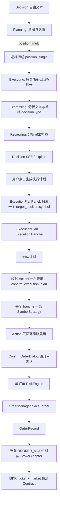
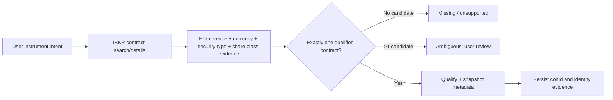
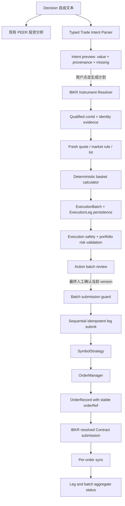

# WealthPilot 多标的交易执行闭环 Current Code Reuse / Gap Audit

> 审计日期：2026-08-15
>
> 审计分支：`codex/portfolio-sync-corrections`
>
> 审计 HEAD：`7b474a9b6114fa69a44f2827a27236cbc0856510`
>
> 当前 `main` / `origin/main`：`fa9d65d4247d5a6984e033816c28246e61107c97`
>
> 审计方式：READ / TRACE / READ-ONLY CONNECTIVITY CHECK / DOCUMENT
>
> 本文不是 PRD，不授权实现或交易。

## 1. Executive Summary

当前代码已经具备约 **55% 的可复用工程构件**，包括 Decision 对话入口、人工触发模式、ActionDraft、单标的 ExecutionPlan、SymbolStrategy、OrderRecord、订单级风控、人工确认、OrderManager、IBKR adapter、审计日志和订单轮询。但若按“用户一句话生成可安全提交的 4 标的 IBKR 篮子”衡量，当前端到端产品能力仅约 **25%～30%**：现有构件能够承载单标分析、单标多批次和逐笔订单，却没有可靠的多标交易意图、合约唯一解析、篮子预算/资金预留和批次幂等。

不建议重构既有 Decision、ExecutionPlan 或 Action 主干。推荐采用 **方案 B：保留单标的 `ExecutionPlan / ExecutionTranche`，新增 `ExecutionBatch / ExecutionLeg`**，并复用 `SymbolStrategy / OrderRecord / OrderManager / AuditLog` 作为最终逐腿执行轨道。

最大三个 Gap：

1. **Instrument Identity**：当前 IBKR 下单由 `ticker + market` 临时构造 `Stock`，不做搜索、筛选、qualify 或 conId 固化；LSE、USD trading line、Acc 均无法被当前下单契约证明。
2. **Budget correctness**：没有 amount → quantity 的篮子级确定性计算，没有可用现金、open order 占用、手续费 buffer、reserved cash 或 remainder 权威语义。
3. **Batch safety**：没有批次状态、批次确认快照、跨腿风险校验或服务端幂等；页面超时后再次点击可能创建新 OrderRecord 和新 orderRef，存在重复提交风险。

v1 技术可行，但应严格限定为：IBKR、单账户、LSE、USD、BUY、LIMIT、整股、人工确认、无自动执行。当前 `codex/portfolio-sync-corrections` 分支提供了有价值的 IBKR 持仓 Contract metadata 与逐币种 CashBalance 前置能力，但这些改动尚未进入 `main`，且仍不是交易合约解析器、AvailableFunds 或资金预留实现。

## 2. Baseline And Governance

审计开始时工作树干净，当前分支相对 `main` ahead 3 / behind 0：

- `7fc7a50`：Dashboard 优先显示 broker sync 导入；
- `f6f1fff`：按 broker/account authoritative snapshot 对账；
- `7b474a9`：IBKR 持仓 Contract metadata 与逐币种现金读取。

这些提交尚未合并，不应被描述为 `main` 已有能力。对本功能的影响如下：

| 前置能力 | `main` | 当前审计分支 | 对 Basket Execution 的意义 |
| --- | --- | --- | --- |
| Broker/account ownership | 不完整 | 有明确归属列与 snapshot reconciliation | 可作为账户事实前置，但不是订单归属模型 |
| IBKR position metadata | 仅基础 symbol/currency | 含 `local_symbol/sec_type/exchange/primary_exchange/con_id/long_name` | 可复用读取与映射经验，不可替代下单前 resolver |
| IBKR per-currency cash | 无 Dashboard 真值链路 | 读取非 BASE `CashBalance` 并同步 | 可作为现金展示事实；不等于 settled/available/reserved cash |

GitHub 线上 Ruleset `Protect main with Quality Gates` 处于 active，保护 `main`，要求 linear history、禁止 deletion/non-fast-forward，并以 strict up-to-date 方式要求：

- `Backend tests`
- `Frontend checks`
- `Offline M5`

`Quality Gates` workflow 当前 active；最新 `main@fa9d65d...` push run 已成功。本文只新增审计材料，不改变这些规则。

## 3. Current Flow

### 3.1 从真实 Case 进入当前代码

用户自由文本由 `frontend/src/pages/Decision.tsx` 调用 Decision SSE API。后端 `decision_service_v3` 依次进入 Planning、Executing、Expressing、Reviewing：

- Planning 的意图类型仍是 PositionDecision / PortfolioReview / AssetAllocation / PerformanceAnalysis / GeneralChat，没有 `TradeIntent`。
- 多标文本可进入 `position_multi`，但实现是把标的循环拆成多次 `position_single` 分析，再生成横向比较文本。
- 多标 `done` 事件仅返回 `conclusion_level=multi_asset`，不返回 `decisionResult`、actionable 或结构化多腿交易数据。
- 单标 actionable 只由 `structured_payload.decisionType ∈ {buy_init, buy_more, trim, exit}` 的硬规则决定。
- Reviewing 校验的是投资分析输出，不校验 broker、account、venue、currency、contract、amount 或 remainder。

因此本 Case 最多到达“4 标的分析文本”，不能自然进入可执行篮子。即使某个单标结果 actionable，Decision 前端也只从当前 `explainData.data.target_position.symbol` 取一个 symbol，构造一个 `ExecutionPlanPanel`。

### 3.2 当前真实数据流



### 3.3 ActionPlanner 的旁路

`wp-action-planner` 由 `/api/action/drafts/generate` 手动调用，不在 PEER 主路由中。它可以让 LLM 产生多个 `symbol_strategies`，所以在 JSON 形态上支持多 symbol；但它不支持 broker、account、target amount、venue、currency、share class、allocation mode/remainder 或 resolved contract。

更关键的是，当前 prompt 允许 LLM：

- 从仓位百分比推算 quantity；
- 从价格区间取中点；
- 没有明确限价时直接使用 current price 作为 limit price。

这些行为适合“可编辑建议草稿”，不适合作为真实交易的最终数字权威。结论是：**不应把现有 ActionPlanner 直接扩展成最终交易解析与计算器**。可复用其对话上下文装配、missing field 和人工草稿模式；应新增职责更窄的 typed Trade Intent Parser/Skill，只提取用户表达和来源，不产出最终 contract、quantity、limit 或执行状态。

### 3.4 ExecutionPlan 当前边界

当前 `ExecutionPlan` 是严格的“一个 symbol、一个 market、一个 side、一个 target、多 tranche”：

- ORM 主表只有一个 `symbol/market/side`，Tranche 不携带 instrument identity；
- Generate API 请求也是单 symbol；
- Rule Engine 依据 target position pct 计算总股数并拆批；
- 因子来自日线 OHLCV，`current_price` 实际是最后一根日线 close；
- limit price 是 trigger price 按固定 `0.2%` buffer 调整后再按 US/HK tick 取整；
- tick 只支持 HKEX 档位或默认 US `$0.01`，没有 IBKR market rule；
- 新建仓 fallback 用 `total_assets * pct / current_price`，代码已承认需要币种一致；
- 持久化、确认、Action UI 都围绕同标的多批次。

因此它不能自然表达本 Case 的四个 ETF。把 4 个 ETF 塞进 Tranche 会破坏 Tranche 的“同一标的分批”语义、factor snapshot、trigger evaluator、Action 分组和成交进度含义。

## 4. Real Case Structured Interpretation

以下是目标概念结构，不是现有模型，也不是最终 PRD：

```text
trade_intent
  broker = IBKR
  account = <resolved, never exposed in document>
  funding_source = CASH
  funding_currency = USD
  stated_cash = 16632 USD
  available_budget = <fresh broker fact>
  venue = LSE
  trading_currency = USD
  share_class = Acc
  side = BUY
  order_type = LIMIT
  legs
    IBTA: APPROX_AMOUNT 11350 USD
    VDCA: APPROX_AMOUNT 2850 USD
    CBU0: APPROX_AMOUNT 1400 USD
    IB01: REMAINDER
```

字段来源必须随值保存：

| Field | Case value | Provenance | Boundary |
| --- | --- | --- | --- |
| broker | IBKR | USER_EXPLICIT | AI 可提取；系统验证 adapter/capability |
| account | 未给出账号 | PORTFOLIO_FACT → BROKER_RESOLVED | 不允许 AI 猜；只能从已连接账户选择/校验 |
| funding_source | CASH | USER_EXPLICIT | AI 可提取，系统校验可用性 |
| funding_currency | USD | USER_EXPLICIT | 系统与账户现金事实对账 |
| stated_cash | 16,632 | USER_EXPLICIT | 仅陈述值，不得当最终 available cash |
| available_budget | 未知 | PORTFOLIO_FACT / BROKER_RESOLVED | 最终确认时刷新；当前代码只部分具备 CashBalance |
| side | BUY | USER_EXPLICIT | 系统白名单校验 |
| order_type | LIMIT | USER_EXPLICIT | 系统白名单校验 |
| venue | LSE | USER_EXPLICIT | resolver 必须验证 |
| trading_currency | USD | USER_EXPLICIT | resolver 必须验证 |
| share_class | Acc | USER_EXPLICIT | resolver 必须找到可审计识别依据；当前缺失 |
| IBTA instrument text | IBTA | USER_EXPLICIT | 不是最终 identity |
| IBTA allocation_mode | APPROX_AMOUNT | AI_INFERRED | “约”允许解析为近似金额，但容差是 MISSING/产品决策 |
| IBTA target_amount | 11,350 USD | USER_EXPLICIT | 最终 quantity 由规则计算 |
| VDCA allocation_mode | APPROX_AMOUNT | AI_INFERRED | 同上 |
| VDCA target_amount | 2,850 USD | USER_EXPLICIT | 同上 |
| CBU0 allocation_mode | APPROX_AMOUNT | AI_INFERRED | 同上 |
| CBU0 target_amount | 1,400 USD | USER_EXPLICIT | 同上 |
| IB01 allocation_mode | REMAINDER | AI_INFERRED | 必须让用户在结构化预览中确认 |
| IB01 target_amount | 动态 | CALCULATED | 不能把 1,032 当固定金额 |
| resolved contract per leg | 未知 | BROKER_RESOLVED | conId 等由 resolver 固化 |
| quote / min tick / lot size | 未知 | BROKER_RESOLVED | 带 as-of、来源与 stale 状态 |
| final limit price | 未知 | MISSING → CALCULATED/USER_EXPLICIT | 用户只指定 LIMIT，未指定价格策略 |
| final quantity | 未知 | CALCULATED | 规则引擎用 limit、lot、budget、fee buffer 算出 |
| estimated notional/residual | 未知 | CALCULATED | 每次 quote/计划修改后重算 |
| fee reserve | 未知 | MISSING | 产品策略必须明确 |

“约”不能由 AI 自行定义百分比容差。Parser 只保存原文和 `APPROX_AMOUNT`，容差或整股偏差规则应由产品政策与确定性 validator 决定。

## 5. Current Code Reuse Matrix

| Capability | Existing Module | Reuse decision | Notes |
| --- | --- | --- | --- |
| Decision chat | `Decision.tsx`, Decision SSE API | REUSE_AS_IS | 保留对话与流式体验 |
| PEER analysis | Planning/Executing/Expressing/Reviewing | EXTEND | 分析可复用；新增 typed trade-intent 输出边界 |
| Multi-asset analysis | `_handle_position_multi` | DO_NOT_REUSE | 是文本横评，不是篮子交易编排 |
| Actionable hard rule | `_is_actionable` | EXTEND | 只能表达单标 decisionType |
| Intent parsing | current intent recognizer | EXTEND | 新增交易字段、provenance 与 missing states |
| ActionPlanner | `wp-action-planner` / `action_planner.py` | DO_NOT_REUSE | 不作为最终数字/合约权威；只复用交互与 missing-field 思路 |
| ExecutionPlan | `execution_plan.models/api` | REUSE_AS_IS | 保持单标多 tranche；不要扩成篮子 |
| Factor snapshot | `execution_plan/factors.py` | REUSE_AS_IS | 可用于单腿投资解释，不是 executable quote |
| Rule engine | `execution_plan/rule_engine.py` | EXTEND | 可复用确定性原则；需独立 basket amount/qty calculator |
| Kline provider | `kline_provider.py` | DO_NOT_REUSE | 日线 K 线不能作为最终订单 quote |
| Market data | 现有 Futu/Tiger/AV fallback | EXTEND | 分析可复用；提交前需 IBKR-compatible executable quote contract |
| Contract metadata read | feature branch `IBKRBrokerAdapter.get_positions` | EXTEND | 只读持仓 enrichment；尚未在 main，且不解析目标标的 |
| Instrument resolution | 无 | NEW | search/details/filter/unique/qualify/persist |
| Cash balance | feature branch `get_account_info` + sync | EXTEND | `CashBalance` 不等于 AvailableFunds 或 reservation |
| Execution persistence | `ExecutionPlan/Tranche` | EXTEND | 单标计划继续；篮子另建权威层 |
| ActionDraft | `action_drafts` | EXTEND | 可作来源草稿；不能作为 batch 状态权威 |
| AllocationIntent | `allocation_intents` | DO_NOT_REUSE | 资产配置容器，不直接下单，语义不等于交易篮子 |
| SymbolStrategy | `symbol_strategies` | EXTEND | 每个可提交 leg 可链接一条策略 |
| OrderRecord | `order_records` | EXTEND | 继续做每笔券商订单；需 leg/batch linkage 与唯一约束 |
| Risk check | `risk_engine.py` | EXTEND | 复用 portfolio risk；另增 execution safety validation |
| Confirm dialog | `ConfirmOrderDialog.tsx` | EXTEND | 可复用单腿详情/确认模式；篮子需新的聚合确认 UI |
| OrderManager | `order_manager.py` | EXTEND | 复用逐笔创建/提交/同步；需 idempotent leg submit orchestration |
| IBKR adapter read loop | `IBKRBrokerAdapter._run_on_loop` | REUSE_AS_IS | dedicated loop、timeout、普通值对象可复用 |
| IBKR order adapter | `IBKRBrokerAdapter.place_order` | EXTEND | 安全护栏可复用；必须接受 resolved contract，支持 LSE |
| AuditLog | `AuditLog` / `_audit` | REUSE_AS_IS | 增加 batch/leg 事件与快照引用 |
| Order status sync | `OrderPoller`, adapter status mapping | REUSE_AS_IS | 每笔订单继续同步，batch 状态聚合在上层 |
| Frontend Decision | `Decision.tsx`, `ExecutionPlanPanel` | EXTEND | 新增 trade-intent preview 与 basket entry；保留手动触发 |
| Frontend Action | `Action.tsx`, `ActionDraftCard` | EXTEND | 策略/订单卡可复用；新增 batch group/review/aggregate status |

## 6. ExecutionBatch Design Decision

| Option | Semantics | Reuse | State/audit | UI/order tracking | Migration/complexity | Decision |
| --- | --- | --- | --- | --- | --- | --- |
| A. 扩展 `ExecutionPlan` 多标的 | 混淆“一个标的分批”与“多个标的篮子” | 表面复用高，实则改动所有 plan/tranche 假设 | factor snapshot、trigger、完成度语义变复杂 | 既要腿又要 tranche，层次混乱 | 高风险迁移和回归 | 不推荐 |
| B. 保留单标 Plan，新增 Batch/Leg | Batch 表示一次资金与确认边界；Leg 表示一项标的配置 | 下游 Strategy/Order 全部可复用 | 可独立记录预算、resolver、确认快照和聚合状态 | 自然支持篮子 review 与逐腿追踪 | 新增两张核心表，复杂度可控 | **推荐** |
| C. ActionDraft/SymbolStrategy 直接当 batch | Draft 是短生命周期 JSON；Strategy 是单标执行策略 | 初始代码少 | 无预算/解析/预留/批次状态权威，审计弱 | 只能前端临时分组，超时恢复困难 | 早期快、后期补债高 | 不推荐作为权威模型 |

推荐目标关系：

```text
ExecutionBatch 1 ── N ExecutionLeg
ExecutionLeg 0..1 ── 1 SymbolStrategy
SymbolStrategy 1 ── N OrderRecord
ExecutionLeg 可选链接单标 ExecutionPlan，但 v1 即时篮子不强制创建单标多 tranche。
```

Batch 负责：broker/account、funding currency/source、budget snapshot、reservation、确认版本、source decision、聚合状态。Leg 负责：用户意图、allocation mode、目标金额、resolved instrument snapshot、quote/limit/quantity/notional/residual、linked strategy/order 和逐腿状态。

## 7. Data Model Gap

### 7.1 当前实体与适配性

| Entity | Current authority | Basket fit | Recommendation |
| --- | --- | --- | --- |
| ActionDraft | AI/用户可编辑 JSON 草稿 | 可暂存多 symbol，但无强契约和执行状态 | 保留为来源或 presentation draft，不当 batch authority |
| AllocationIntent | 组合目标配置 | 不直接产生订单 | 不复用为交易篮子 |
| SymbolStrategy | 单标执行目标，1:N orders | 适合每个 resolved leg 的下游策略 | 增加 leg linkage，不承载全篮子预算 |
| OrderRecord | 单笔券商订单 | 适合逐腿提交/成交状态 | 增加稳定 leg/batch 关联与幂等约束 |
| ExecutionPlan | 单 symbol 多 tranche | 不适合多 symbol | 保持不变 |
| ExecutionTranche | 同一 plan 的分批 | 不适合代表不同 ETF | 保持不变 |

### 7.2 新概念是否需要独立实体

| Future concept | Need | Persistence recommendation |
| --- | --- | --- |
| StructuredTradeIntent | 需要 typed contract，不一定需要独立表 | 作为 Batch 的 immutable source snapshot + provenance JSON；避免额外生命周期表 |
| ExecutionBatch | **需要新实体** | 资金、账户、确认、版本与聚合状态的唯一权威 |
| ExecutionLeg | **需要新实体** | 每个标的的 allocation、resolved identity、quote/calculation 与链接状态 |
| ResolvedInstrument | 需要概念，不必首版单独建表 | 在 Leg 固化通用列 + broker metadata JSON；以后有 instrument master 再抽表 |
| CashReservation | 能力必需；是否独立表取决于并发策略 | 若 v1 强制同 account/currency 仅一个 active batch，可先落 Batch reservation 字段；允许并发则必须独立、事务化 reservation ledger |

任何 persisted resolved instrument 至少应包含：`broker, conId, symbol, localSymbol, secType, exchange, primaryExchange, currency, tradingClass, longName`，并保留 resolution time、resolver version、候选证据。Acc 的识别证据字段必须显式保存，不能只把 “Acc” 写进展示文案。

## 8. API Gap

当前相关 API：Decision `/chat`；ActionDraft generate/CRUD/confirm；ExecutionPlan generate/persist/confirm/update-tranches/adjust；Strategy risk/place；Order list/get/cancel。它们均没有 basket authority。

| Capability | Current API | Gap classification | Required behavior, not endpoint design |
| --- | --- | --- | --- |
| Parse trade intent | 无 typed API | NEW | 返回字段值、provenance、原文证据、missing/ambiguous |
| Resolve instruments | 无 | NEW | 返回候选与唯一结果；歧义必须 fail closed |
| Generate batch | 单标 `/execution-plan/*` | NEW | 以 amount/remainder 生成多 leg 预览并持久化版本 |
| Refresh quotes | 无 executable quote API | NEW | 带 source/as-of/stale/minTick/marketRule/lot |
| Recalculate quantity | 单标 target-pct engine | NEW | amount/limit/lot/budget/fee 的确定性重算 |
| Validate batch | 仅单订单 risk | NEW | contract/cash/account/currency/conflict/zero qty/quote freshness |
| Confirm batch | 单 plan confirm、单 draft confirm | NEW | 固化确认版本和参数 hash，禁止确认后静默变化 |
| Submit batch | 单 strategy place | NEW | 稳定 leg id，逐腿编排，非原子结果可恢复 |
| Retry/reconcile leg | order status + adapter `find_order_by_ref` 未接上层 | EXTEND | 先按稳定 orderRef 对账，再决定是否允许新 attempt |
| Batch status | 无 | NEW | 从 leg/order 状态确定性聚合并暴露 attention state |

## 9. UI Gap

| Surface/component | Current | Recommendation | Gap |
| --- | --- | --- | --- |
| Decision chat | 支持自由文本和多标分析 | REUSE | 保留输入/SSE |
| Actionable CTA | 由单标 decisionType 控制 | EXTEND | trade intent 完成后展示“生成交易执行计划”，仍需用户点击 |
| Intent preview | 无 | NEW | 展示 broker、资金、4 legs、来源、missing/ambiguous；用户确认 AI 解析 |
| ExecutionPlanPanel | 单 symbol/target pct/multi tranche | REUSE | 继续服务现有单标计划，不强塞 basket |
| Basket preview | 无 | NEW | 展示 cash、reserve、total、residual、quote 时点和每腿 resolved contract/qty/limit/notional |
| ActionDraftCard | 支持 N 策略编辑，计划模式要求同 symbol | EXTEND | 可复用表格/校验样式，不复用其现有同标假设 |
| Action page grouping | 按 intent 或 plan_id 分组 | EXTEND | 增加 batch_id 分组及 aggregate status |
| ConfirmOrderDialog | 单策略、单订单确认 | REUSE | 保留单腿 retry/manual path |
| BatchConfirmationDialog | 无 | NEW | 一次查看整体并确认固定版本；不能用 4 次弹窗冒充一次 batch 确认 |
| Order cards/timeline | 逐订单状态与审计 | REUSE | 在 batch/leg 下嵌套并聚合 |

Batch review 至少展示：Broker、masked account、available cash 口径与时点、reserved/fee buffer、estimated total、estimated residual；每腿展示 resolved identity、LSE venue、USD、Acc 证据、quantity、limit、estimated notional、quote as-of、风险和状态。

## 10. IBKR Contract Resolution

### 10.1 当前下单 Contract 构造

`IBKRBrokerAdapter.place_order` 当前：

1. 用 adapter 自有 `_parse_symbol` 把 `TICKER:MARKET` 解析为 market/ticker；
2. 只允许 `SUPPORTED_MARKETS={US, HK}`；
3. 映射 `US → SMART/USD`，`HK → SEHK/HKD`；
4. 构造 `Stock(symbol=ticker, exchange=..., currency=...)`；
5. 不调用 contract search、`reqContractDetails` 或 qualify；
6. 输入没有 `conId/primaryExchange/localSymbol/tradingClass`；`secType` 只是 `Stock` 默认的 `STK`；
7. 由 IB Gateway 在下单时尝试解析该不完整 Contract。

最终 raw response 会记录 IB 返回的部分 conId/contract 字段，但这是提交之后的结果，不是提交之前的安全验证。

### 10.2 LSE 支持结论

当前不支持 LSE：

- 全局 `VALID_MARKETS` 只有 US/HK/SH/SZ/CN；
- IBKR adapter 只有 US/HK 白名单；
- 没有 LSE/LSEETF 的 exchange/currency 映射；
- `IBTA:LSE` 会被现有 parser/白名单拒绝；
- 把 LSE USD ETF 写成 `IBTA:US` 会走 SMART/USD，不能证明选中 LSE USD Acc line。

当前审计分支的只读持仓 enrichment 能看到 `exchange/primary_exchange/local_symbol/con_id`，并曾把 LSEETF + USD 的持仓带回系统；但下单路径完全不消费这些字段，而且 broker sync 的 currency fallback 仍可能把 LSE USD line 归为 `:US`。这说明 metadata 前置有帮助，同时也证明当前 `TICKER:MARKET` 身份模型不足。

### 10.3 Ticker 唯一性

裸 ticker 不应视为唯一身份。候选可能因 exchange、trading currency、share class、listing、local symbol 或 contract id 不同而并存。`IBTA/VDCA/CBU0/IB01 + LSE + USD + Acc` 是用户的筛选约束，不是已经 resolved 的 Contract。

建议新增 `BrokerInstrumentResolver`：



最终下单应基于 persisted qualified `conId`/Contract snapshot，并在提交前再次验证关键属性；不应重新从 ticker 猜 Contract。通用字段放 Leg，IBKR 的完整 ContractDetails 放 broker metadata JSON，避免把核心模型绑死到 IBKR。

### 10.4 Real IBKR read-only probe

2026-08-15 补充执行了严格 read-only evidence probe。执行前确认：

- `127.0.0.1:4001` 正在监听；
- ignored 配置为 `IBKR_READ_ONLY_MODE=true`；
- `ENABLE_IBKR_LIVE_TRADING=false`；
- 使用独立 clientId 且 `connectAsync(..., readonly=True)`；
- 探针代码只调用 `reqMatchingSymbolsAsync`、`reqContractDetailsAsync`、`qualifyContractsAsync` 和 `reqMarketRuleAsync`；
- 未调用或输出 account、positions、orders API，也未调用 place/cancel/modify/replace 等 mutation。

#### 10.4.1 Candidate count

IBKR 的 ContractDetails 会因可路由 exchange 返回同一 conId 的多行，因此必须同时记录 raw row 数与去重后的 conId 数：

| Input ticker | Symbol search total / exact | Broad details | LSEETF + USD result | Unique qualified conId | Conclusion |
| --- | ---: | ---: | ---: | ---: | --- |
| IBTA | 5 / 3 | 38 rows；其中 4 rows 可路由 LSE/USD | 1 direct row | 1 | `symbol=IBTA` 可唯一解析 |
| VDCA | 3 / 2 | 11 rows；其中 4 rows 可路由 LSE/USD | 1 direct row | 1 | `symbol=VDCA` 可唯一解析 |
| CBU0 | 3 / 2 | 按 `symbol=CBU0` 为 6 rows、LSE/USD 为 0；按 `localSymbol=CBU0` 为 7 rows | 1 direct row | 1 | 必须按 localSymbol 解析；底层 symbol 不是 CBU0 |
| IB01 | 2 / 1 | 9 rows，均归并为同一 LSE/USD conId | 1 direct row | 1 | `symbol=IB01` 可唯一解析 |

与唯一性有关的碰撞证据：

- `IBTA` 的 exact-symbol search 还返回 NYSE 的 Ibotta Inc Class A（USD）和 EBS 的 CHF trading line；ticker 单独明显不唯一。
- `VDCA` 还返回 BVME.ETF 的 EUR trading line。
- `CBU0` 作为 IBKR `symbol` 时会命中 EUR 的 iShares Core GBP Corporate Bond ETF，以及 VALUE venue 的另一条 7–10Y Treasury 记录。目标 LSE/USD 合约实际是 `symbol=CSBGU0, localSymbol=CBU0`。
- `IB01` 的 exact-symbol search 在本次会话中只有一个目标证券候选。

#### 10.4.2 Qualified LSE/USD Contract evidence

| User ticker | conId | symbol / localSymbol | secType / stockType | exchange / primaryExchange | currency | tradingClass | longName | ISIN |
| --- | ---: | --- | --- | --- | --- | --- | --- | --- |
| IBTA | `272686955` | `IBTA / IBTA` | `STK / ETF` | `LSEETF / LSEETF` | USD | `EUET` | `ISHARES USD TRSRY 1-3Y USD A` | `IE00BYXPSP02` |
| VDCA | `354532794` | `VDCA / VDCA` | `STK / ETF` | `LSEETF / LSEETF` | USD | `EUET` | `VAND USDCP1-3 USDA` | `IE00BGYWSV06` |
| CBU0 | `79000139` | `CSBGU0 / CBU0` | `STK / ETF` | `LSEETF / EBS` | USD | `EUET` | `ISHARES USD TRES BOND 7-10Y` | `IE00B3VWN518` |
| IB01 | `354802220` | `IB01 / IB01` | `STK / ETF` | `LSEETF / LSEETF` | USD | `EUET` | `ISHARES US TREAS 0-1YR USD A` | `IE00BGSF1X88` |

四个目标都通过 `qualifyContractsAsync` 返回了上表唯一合约。IBKR 对 LSE ETF 的实际 direct exchange code 是 **`LSEETF`**；`marketName` 为 `EUET`。不能假设 `primaryExchange` 也总是 `LSEETF`：CBU0 的 direct exchange 是 `LSEETF`，但 `primaryExchange=EBS`。

`secType` 均为 `STK`，ETF 属性来自 ContractDetails 的 `stockType=ETF`，所以 resolver 不能用 `secType == ETF` 作为条件。`validExchanges` 还包含 SMART、EUIBSI、TRWBUKETF 等可路由 venue；最终持久化必须保留本次选择的 direct exchange，而不能只保存 valid-exchange 列表。

#### 10.4.3 Min tick and market rule evidence

| Ticker | ContractDetails minTick | LSEETF marketRuleId | Returned rule |
| --- | ---: | ---: | --- |
| IBTA | 0.0001 | 1874 | 分层：0/0.1/0.2/0.5→0.0001；1→0.0002；2→0.0005；5→0.001；10→0.002；20→0.005；50→0.01；100→0.02；200→0.05；500→0.1；1000→0.2；2000→0.5；5000→1；10000→2；20000→5；50000→10 |
| VDCA | 0.001 | 98 | 从 0 起固定 0.001 |
| CBU0 | 0.0005 | 983 | 0→0.0005；0.1→0.001；5→0.0025；10→0.005；25→0.01 |
| IB01 | 0.0001 | 1874 | 同 IBTA 的 rule 1874 |

这证明现有“US 固定 `$0.01` tick”的下单前取整逻辑不能用于这些 LSE trading lines；应按 selected exchange 对应的 marketRuleId 和下单价所在区间计算 tick。

#### 10.4.4 Acc evidence and remaining identity gap

IBKR 本次返回的可用证券标识还包括：

- `secIdList`：四个目标都返回一个 ISIN；
- `stockType=ETF`；
- `marketName=EUET`；
- `validExchanges` 与对应 `marketRuleIds`；
- symbol search 的 `description` 和 ContractDetails 的 `longName`；
- qualify 后的 conId、symbol、localSymbol、exchange、primaryExchange、currency、tradingClass。

没有返回明确的 `distributionPolicy`、`shareClass=Acc` 或 `accumulating=true` 字段；`secIdType/secId` 和 `issuerId` 在本次结果中也为空。IBTA/VDCA/IB01 名称末尾的 `A/USDA` 只能作为线索，不能可靠证明 accumulating；CBU0 的 longName 甚至没有该后缀。因此：

- **LSE + USD + 正确的 symbol/localSymbol 约束足以把四个 trading line 各自过滤到一个 conId。**
- **LSE + USD 本身不足以证明 Acc。** 四个标的不能仅凭本次 IBKR metadata 完整满足 “LSE USD Acc” 的自动唯一解析。
- PRD 应要求用 ISIN 对照发行人/经人工确认的权威资料；确认后保存 trusted mapping：用户 alias、ISIN、conId、symbol、localSymbol、secType、stockType、exchange、primaryExchange、currency、tradingClass、longName、验证来源/人员/时间和 resolver version。
- 在该 trusted mapping 建立后，四个标的都可稳定 resolve 到上表 conId；建立前应把 Acc 标记为 `MANUAL_VERIFICATION_REQUIRED`，不得因为候选只有一个就宣称 share class 已验证。

## 11. LSE / USD / Acc Gap

| Constraint | Current representation | Gap |
| --- | --- | --- |
| LSE | 无 market enum/adapter mapping | parser、API、model、quote、trading hours、adapter 都未覆盖 |
| USD trading line | US market 被默认等同 USD | 货币与 venue 被错误耦合；LSE 可以有 USD line |
| Acc | 无字段 | 当前不能验证 accumulation vs distribution |
| ETF identity | IBKR 常可用 STK Contract 表达交易所 ETF | 不能只靠 secType；需 ContractDetails/issuer identity evidence |
| Instrument uniqueness | ticker | 必须升级为 broker-qualified conId + metadata snapshot |

本次 read-only probe 已确认 Acc 无可直接依赖的单一 IBKR 字段。PRD 必须定义基于 ISIN 的外部/人工核验和 trusted mapping，并在证据不足时 fail closed。

## 12. Limit Price Gap

用户只指定了 LIMIT，没有给具体价格。现有 ExecutionPlan 的 limit 并非 executable quote policy：它用日线最后 close 及 ATR/阶梯生成 trigger，再按固定 `0.2%` buffer 得到 limit；US 固定按 `$0.01`，HK 使用内置档位表。它没有 bid、ask、mid、实时 last、quote freshness、LSE market rule 或 IBKR min tick。

Basket v1 需要独立的 `LimitPricePolicy` 概念，但本轮不确定算法。PRD 必须明确：

- buy limit 的基准是 ask、mid、last 还是用户值；
- 最大允许偏离/滑点；
- IBKR market rule/min tick 的取整方向；
- quote stale threshold 与 refresh 时机；
- 闭市、延迟行情、无订阅/无行情时是否拒绝；
- 用户手动覆盖的范围，以及覆盖后是否重新校验/确认；
- 从 preview 到 submit 价格变化多大时强制重新确认。

Factor Snapshot 可继续用于投资逻辑解释，不能冒充下单 quote。

## 13. Amount To Quantity Gap

当前 OrderRequest 要求整数 `quantity + limit_price`。ExecutionPlan 的 target basis 实际持久化为 QUANTITY；规则引擎由持仓/仓位百分比换算，而不是原币 target amount。对本 Case 需要新的确定性计算：

```text
usable_amount = target_amount or current_remainder_budget
raw_quantity = usable_amount / limit_price
quantity = floor_to_lot(raw_quantity, lot_size)
estimated_notional = quantity * limit_price
residual = usable_amount - estimated_notional - allocated_fee_buffer
```

计算器必须接收并审计：target amount、allocation mode、trading currency、fresh limit、min tick、lot size/whole-share policy、fee reserve、已预留资金和其他腿 notional。AI 只能提取 amount 与解释，不得给最终 quantity、tick rounding、notional 或 residual。

v1 建议整股且只 BUY/LIMIT；quantity 算到 0 必须显示不可执行，不得静默删除该 leg。现有 `max(..., 1)` 的单标计划逻辑不能复用于金额篮子，否则可能强行超预算买 1 股。

## 14. Remainder Semantics

| Option | Predictability | Cash safety | Partial/reject behavior | UX/complexity | Assessment |
| --- | --- | --- | --- | --- | --- |
| A. 生成计划时一次性固定全部数量 | 高 | quote/fee/open orders 变化会超限 | 无法回收前腿未用资金 | 一次确认、实现最简单 | 不推荐用于“全部现金”语义 |
| B. 前三腿提交后动态计算 IB01 | 低，最终量会变化 | 可基于最新 AvailableFunds 最接近全用 | rejection/partial fill 会持续改变 remainder | 需要阶段性状态和可能的第二次确认 | 适合未来增强，不建议 v1 默认 |
| C. 最终确认时扣 fee/cash buffer 后静态计算 | 高 | 最保守，不承诺把现金用到零 | 未用资金留作 residual，不自动挪用 | 一次清晰确认，复杂度可控 | **推荐 v1** |

推荐 v1 把 IB01 标记为 REMAINDER，但在最终确认时依据 fresh budget、前三腿固定数量和显式 buffer 计算并冻结其 quantity。提交后出现 rejection/partial fill 时，未使用资金只显示为 residual，不自动扩大 IB01。若未来要真正“尽可能用完”，采用方案 B，并对重算后的数量/价格执行第二次人工确认。

## 15. Cash / Reservation

当前系统没有 reserved cash、pending order notional 或 batch budget ledger。订单级 RiskEngine 只比较组合 CNY 市值、单笔比例和集中度，不读取 broker available cash；纪律检查失败甚至会记录 warning 后放行，而不是执行安全校验。

当前审计分支新增的 IBKR `CashBalance` 是逐币种余额展示真值，但仍缺：

- `AvailableFunds` / settled cash / buying power 的产品口径选择；
- 已提交/open orders 的现金占用；
- 未提交但已确认 batch 的 reservation；
- fees 与 price buffer；
- 同账户同币种并发 batch 的事务互斥；
- quote 刷新或用户编辑后的 reservation 重算。

必须把两类检查分开：

**Portfolio / investment risk**：单笔比例、集中度、纪律、资产配置风险，可扩展现有 RiskEngine。

**Execution safety validation**：contract 唯一、account/broker/currency 一致、quantity > 0、quote 新鲜、limit 合法、总 notional + reserve ≤ available budget、open order conflict、batch/leg idempotency。这应是独立 validator，任何失败均 fail closed，不能用风险确认文字绕过。

## 16. Batch State And Submission Semantics

多笔 Broker order 不具备数据库 ACID 原子性。现有 OrderManager 可以分别留下成功、rejected、unknown 的 OrderRecord，但没有上层对象表达：leg 1/2 已提交、leg 3 rejected、leg 4 尚未尝试。

推荐由 ExecutionLeg 保存自身准备/提交/订单链接状态，Batch 状态由 legs 确定性聚合。PRD 应围绕以下语义定义最小集合，而不是照抄候选枚举：

- 尚未 resolve/validate 的草稿不能提交；
- ready 必须绑定一个 immutable confirmation version/hash；
- submitting 期间重复请求返回同一 operation；
- 任一 leg 出现 timeout/unknown 时，Batch 进入需人工处理状态并停止后续自动提交；
- 部分 legs 已提交不是“整体失败”，也不能回滚已到 Broker 的订单；
- submitted、partially filled、completed 应由 OrderRecord 聚合，而不是前端猜测；
- cancel batch 只能停止未提交 legs；是否撤销已提交订单必须是另一次明确 mutation/确认，不能当数据库 rollback。

安全默认推荐 **顺序提交 + stop on rejected/unknown**。是否继续提交剩余 legs 是 PRD 产品决策；绝不能把“部分提交”伪装为原子成功。

## 17. Idempotency

现有能力：OrderRecord 先落库；其 UUID 作为 IBKR `orderRef`；IBKR adapter 有 `find_order_by_ref`；网络异常可把本地订单设为 unknown。

现有缺口：

- `find_order_by_ref` 没有接入 OrderManager 的 timeout/retry 路径；
- place endpoint 没有 idempotency key；
- 用户第二次点击会创建新的 OrderRecord UUID 和新的 orderRef；
- DB 没有 batch/leg 唯一约束；
- 前端 `submitting` 只能阻止同一组件生命周期内的双击，不能覆盖 reload、超时或并发请求。

最小方案：

1. `batch_id` 是一次确认对象；`confirmation_version` 或 payload hash 固定本次参数；
2. 每条 `leg_id` 稳定，DB 对“一个确认版本的一条 leg 只能有一个 active submission”做唯一约束；
3. 先持久化 OrderRecord，并始终以其 id 作为 broker orderRef；
4. timeout 后先用该 orderRef reconcile；只有得到确定 not-found 且状态机允许时，才创建显式的新 attempt；
5. 同一个 submit request/idempotency key 重放时返回已有结果，不再次调用 adapter。

## 18. Safety Model

当前已有：

- Gateway Read-Only API 是外部第一道硬门；
- `IBKR_READ_ONLY_MODE=true` 连接使用 readonly，并对已识别的 live account 本地拒绝 place/cancel；
- `ENABLE_IBKR_LIVE_TRADING=false` 与 account prefix 校验阻止正常 live trading 配置；
- Public Demo 强制 MockBroker；
- ConfirmOrderDialog 要求人工勾选，风险警告时要求精确确认文字；
- 后端 place endpoint 重新执行单订单 RiskEngine；
- IBKR 只允许 LIMIT、US/HK、outsideRth=false，并保留 orderRef/audit/status sync。

需要补齐：

1. **Layer 1 — system/broker gate**：现有环境门继续保留；Batch service 也必须显式校验 trading enabled，不能只依赖 UI。adapter 的只读拒绝应在连接解析账户之后再次执行，避免 account 构造时为空导致前置判断不足。
2. **Layer 2 — batch ready gate**：resolved contract、fresh quote、cash reservation、execution validator、immutable version 全部通过。
3. **Layer 3 — human confirmation**：一次展示完整 basket、masked account、资金、每腿参数和非原子语义；确认只对当前 version 有效。
4. **Layer 4 — per-leg OrderManager guard**：每腿再次校验 stable identity、budget reservation、idempotency、数量/限价，并用已有 adapter 安全门提交。

继续采用 `manual_button_only`：AI 分析/解析后先展示 Structured Trade Intent，用户点击才生成 Batch；Batch 再经独立最终确认才可能提交。用户发消息不得自动创建订单或触发 Broker mutation。

## 19. Failure Modes

| Failure mode | Current behavior | PRD must define |
| --- | --- | --- |
| ticker ambiguous | ticker 直接传 adapter | 候选展示、人工选择、超时与 fail-closed |
| 找不到 LSE USD Acc | 不支持 LSE | leg 是否阻断全 batch，如何解释缺失约束 |
| Contract uniqueness failure | 无 resolver | 多候选不得自动选择；需要何种证据 |
| market data unavailable | 单标 plan 可降级或拒绝 | executable quote 缺失时必须拒绝还是允许手填 |
| stale quote | 无提交时效校验 | stale 阈值、刷新及重确认规则 |
| cash insufficient | 不检查 broker cash | 阻断整体还是允许用户减量 |
| quantity rounds to zero | 单标代码可能强制至少 1 股 | basket 必须不可执行并显示 residual |
| price changed | 不重算/不重确认 | 重算阈值、reservation 与 version invalidation |
| one leg rejected | 其他策略独立存在 | stop/continue 策略及 partial-submitted UX |
| Gateway disconnect | 当前订单可变 unknown | 停止后续腿、reconcile 与恢复入口 |
| submission timeout | OrderRecord unknown | 必须按 orderRef 对账，禁止盲重提 |
| duplicate click/reload | 前端临时防双击 | 服务端幂等键与重放响应 |
| partial fill | 单订单可同步 | batch budget/remainder 是否重算，何时完结 |
| last remainder leg | 无语义 | 静态 buffered 或动态二次确认 |
| user changes plan after quote refresh | 无 batch version | 旧确认失效、重新计算与重新确认 |
| open order conflict | 可查询但不参与计划 | 同 instrument/account 冲突规则 |
| fee/commission unknown | 无 reserve | buffer 口径与不足处理 |
| app crash during partial submission | 无 batch operation journal | 恢复时如何辨认已提交/未提交 legs |

## 20. Scope Recommendation

建议 v1 明确限定：

```text
Broker = IBKR only
Venue = LSE / IBKR-resolved LSE trading line
Currency = USD
Side = BUY
Order Type = LIMIT
Quantity = whole shares
One explicitly selected/verified account
One funding currency
Human confirmation required
No automatic execution
No cross-broker / FX conversion / fractional shares / conditional orders
```

同时建议 v1 使用“确认时静态 buffered remainder”，未用资金保留为 residual；不在部分提交后自动放大最后一腿。这个范围显著降低合约、币种、lot、资金和补偿逻辑的组合爆炸，同时保留未来扩到其他 Broker/venue 的 generic Batch/Leg 核心。

## 21. Recommended Target Flow



## 22. Development Phase Recommendation

### Phase 1 — Typed Trade Intent

- **Goal**：把本 Case 稳定解析为 values + provenance + missing/ambiguous，不生成执行数字。
- **Dependency**：现有 Decision conversation/history；明确 v1 scope。
- **Major modules**：Decision contract、独立 Trade Intent Parser/validator、intent preview。
- **Acceptance boundary**：4 legs、REMAINDER、LSE/USD/Acc/LIMIT 可正确表达；AI 不产出 conId/final qty/limit；无 Broker mutation。

### Phase 2 — Resolution And Basket Plan

- **Goal**：唯一解析 IBKR Contract，取得可执行 quote metadata，确定性生成并持久化 Batch/Leg。
- **Dependency**：Phase 1；`portfolio-sync-corrections` 相关账户/metadata 改动经独立 review 后进入 main；PRD 明确 limit/cash/remainder policy。
- **Major modules**：BrokerInstrumentResolver、quote adapter、basket calculator、ExecutionBatch/Leg、execution validator、reservation。
- **Acceptance boundary**：在 read-only/fake adapter 下完成 resolve、amount→qty、cash/fee/remainder 校验；歧义和数据缺失 fail closed；不下单。

### Phase 3 — Action Batch Review And Confirmation

- **Goal**：Action 中恢复、编辑、刷新、校验并确认一个固定版本的 basket。
- **Dependency**：Phase 2 稳定持久化与状态机。
- **Major modules**：Decision intent preview、Action batch group、BatchConfirmationDialog、version/hash、audit、API idempotency。
- **Acceptance boundary**：用户能看到完整资金与合约证据；修改或 quote refresh 使旧确认失效；Mock/fake submission 验证 partial-result UX。

### Phase 4 — IBKR Submission And Recovery

- **Goal**：在所有交易护栏和单独授权下，把 resolved legs 顺序、幂等地交给 IBKR，并可恢复 unknown/partial 状态。
- **Dependency**：前三阶段；真实 read-only Contract probe；独立的交易启用与安全验收。
- **Major modules**：IBKR resolved-contract submit、OrderManager leg orchestration、orderRef reconciliation、poller/batch aggregator。
- **Acceptance boundary**：默认仍 fail closed；任何 live mutation 必须由另行明确授权的验收任务执行；超时/断连/重复请求不产生重复订单。

## 23. Questions To Resolve Before PRD Final

1. **Limit price policy**：BUY LIMIT 默认基于 ask/mid/last/用户输入中的哪一个，允许多大偏离，quote 多久过期，何时强制重新确认？
2. **Acc identity evidence**：IBKR metadata 中哪组字段或外部 instrument master 被认可为 Acc 的权威证据；无法证明时是否一律要求人工选 Contract？
3. **Cash authority**：预算以 CashBalance、AvailableFunds、settled cash 还是更保守值为准；open orders、fees 与 buffer 如何扣除？
4. **Approx amount tolerance**：“约 $11,350”允许因整股/限价产生多大金额偏差；优先不超目标还是最接近目标？
5. **Remainder timing**：v1 是否接受确认时静态 buffered remainder；若要求提交后动态重算，是否必须对 IB01 二次确认？
6. **Batch submission policy**：顺序如何确定；某腿 rejected/unknown 后默认停止还是继续；用户能否选择策略？
7. **Partial fill/retry policy**：部分成交、超时和明确 not-found 分别允许怎样的 retry/recalculate，旧 confirmation 何时失效？
8. **v1 scope**：是否正式接受 IBKR + LSE + USD + BUY + LIMIT + 整股 + 单账户 + 人工确认的限定，并排除 FX、fractional、跨 Broker 与自动执行？

## 24. Audit Closure

- 没有修改产品代码、ORM、API、frontend、Prompt、Skill 或 BrokerAdapter。
- 没有创建实施分支；没有修改 `main`。
- 没有 commit、push、merge 或 tag。
- 没有启用 live trading。
- 没有调用 place/submit/cancel/modify/replace order，也没有 Paper/Live order probe。
- 已在 4001 上完成仅限四个 ticker 的 read-only Contract metadata evidence probe；未读取或输出账户数据。
- 本轮唯一产物是本文件。
